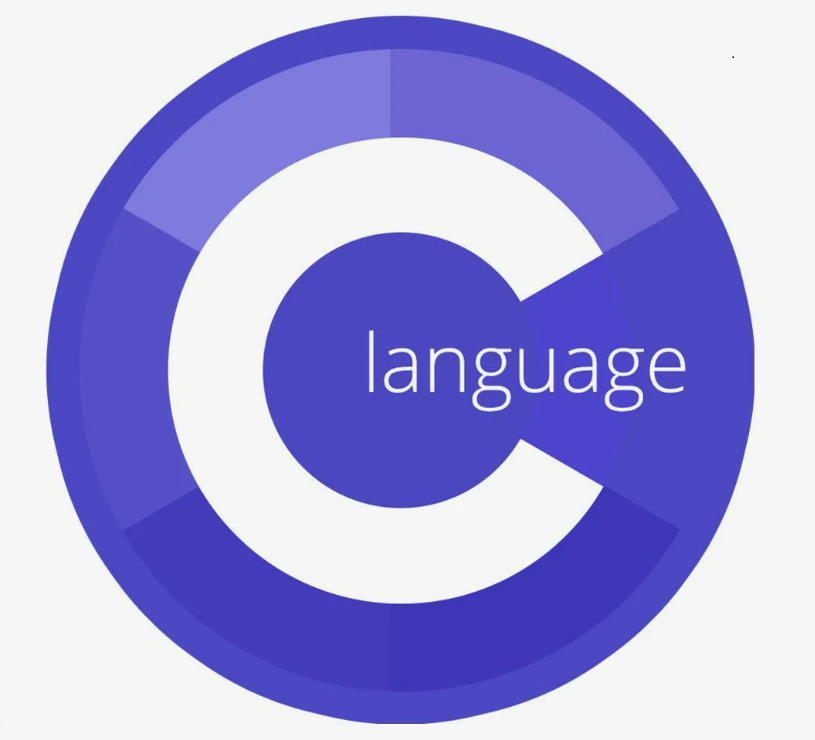

# Программирование на Си. Базовый уровень.

### В этом проекте рассмотрены: 
- Строки и их обработка.

### Файлы: 
1. Варианты объявления и инициализации строк;

(<a href="#readme-top">back to top</a>)

